# Login Flow — Product & System Design

## Overview

The Login flow is the critical entry point for the Employee Time Clock system. This design document outlines the user journey, system architecture, and component interactions that enable secure user authentication and session management.

---

## System Architecture

```mermaid
graph TB
    U["👤 User<br/>(Browser)"]
    LR["📱 Login.razor<br/>(UI Component)"]
    SS["🎛️ SessionState<br/>(Client State)"]
    AUTH["🔐 IAuthService<br/>(Authentication Port)"]
    FAKE["🗄️ FakeAuthService<br/>(Service Implementation)"]
    DB["📊 User Database<br/>(Fake)"]
    NAV["🗺️ NavigationManager<br/>(Router)"]
    DASH["📊 Dashboard<br/>(Target Page)"]
    
    U -->|Enters Credentials| LR
    LR -->|Updates State| SS
    LR -->|Requests Login| AUTH
    AUTH -->|Implements| FAKE
    FAKE -->|Queries Users| DB
    LR -->|On Success| NAV
    NAV -->|Redirects| DASH
    LR -->|Manages Sessions| SS
```

**Key Components:**
- **Login.razor**: Interactive login UI with form fields, error handling, and loading states
- **IAuthService**: Port defining authentication contract
- **FakeAuthService**: Implementation providing demo authentication
- **SessionState**: Client-side state management for session tracking
- **NavigationManager**: Browser navigation and routing

---

## Data Flow


**State Transitions:**
1. **Unauthenticated** → User enters credentials
2. **Validating** → System validates input and authenticates
3. **Authenticated** → Session established, user redirected
4. **Error** → Invalid credentials or network issues, message shown

---

## Login Flow — Movements & Beats

### Movement 1: User Entry & Credential Submission

#### Beat 1.1: User Arrives at Login Page

The user navigates to `/login` and sees the login interface with credential input fields.

```mermaid
sequenceDiagram
    autonumber
    actor U as 👤 User
    participant LR as 📱 Login.razor
    participant SS as 🎛️ SessionState
    
    U->>LR: Navigates to /login
    LR->>SS: Check current user
    SS-->>LR: No active session
    LR->>U: Display login form<br/>(username, password fields)
```

**Outcome**: User sees empty login form with demo credentials helper text and clear call-to-action button.

---

#### Beat 1.2: User Enters Credentials

User types username and password into respective input fields with real-time binding.

```mermaid
sequenceDiagram
    autonumber
    actor U as 👤 User
    participant LR as 📱 Login.razor
    
    U->>LR: Types username
    LR->>LR: @bind updates<br/>username variable
    U->>LR: Types password
    LR->>LR: @bind updates<br/>password variable
    LR->>U: Form fields show<br/>entered values
```

**Outcome**: Form fields contain user-entered credentials, submit button is enabled and ready to be clicked.

---

#### Beat 1.3: User Submits Login Request

User clicks the Login button, triggering validation and authentication.

```mermaid
sequenceDiagram
    autonumber
    actor U as 👤 User
    participant LR as 📱 Login.razor
    participant UI as 🖥️ UI State
    
    U->>LR: Clicks Login button
    LR->>UI: Set isLoading = true
    UI->>LR: Display spinner &<br/>"Logging in..." text
    LR->>U: Button disabled<br/>(prevent double-submit)
```

**Outcome**: Login button becomes disabled with loading spinner animation, indicating work in progress.

---

### Movement 2: Authentication & Server Validation

#### Beat 2.1: Credentials Transmitted to Auth Service

Login component sends username and password to authentication service for validation.

```mermaid
sequenceDiagram
    autonumber
    participant LR as 📱 Login.razor
    participant AUTH as 🔐 IAuthService
    participant FAKE as 🗄️ FakeAuthService
    
    LR->>AUTH: LoginAsync(username, password)
    AUTH->>FAKE: Implementation receives call
    FAKE->>FAKE: Query user database
    Note over FAKE: Password check:<br/>password == username
```

**Outcome**: Credentials reach the authentication service; database query begins.

---

#### Beat 2.2: Authentication Service Validates Credentials

Service checks if user exists and password matches.

```mermaid
sequenceDiagram
    autonumber
    participant FAKE as 🗄️ FakeAuthService
    participant DB as 📊 User Database
    participant AUTH as 🔐 IAuthService
    
    FAKE->>DB: Find user by username
    DB-->>FAKE: UserAccount or null
    alt User exists and password matches
        FAKE->>FAKE: Set _currentUser = user
        FAKE-->>AUTH: Return UserAccount
    else User not found or password wrong
        FAKE->>FAKE: Set _currentUser = null
        FAKE-->>AUTH: Return null
    end
```

**Outcome**: Authentication service returns either a valid `UserAccount` object or `null`.

---

#### Beat 2.3: Response Returned to Login Component

Authentication result is sent back to the UI component.

```mermaid
sequenceDiagram
    autonumber
    participant AUTH as 🔐 IAuthService
    participant LR as 📱 Login.razor
    
    AUTH-->>LR: LoginAsync result<br/>(UserAccount or null)
    LR->>LR: Receive result
```

**Outcome**: Login component receives authentication result and continues to Movement 3.

---

### Movement 3: Success Path — Session Establishment & Navigation

#### Beat 3.1: Login Success — Session Created

On successful authentication, user object is stored in session state.

```mermaid
sequenceDiagram
    autonumber
    participant LR as 📱 Login.razor
    participant SS as 🎛️ SessionState
    participant UI as 🖥️ UI State
    
    LR->>SS: Update CurrentUser<br/>with returned UserAccount
    SS-->>LR: Session established
    LR->>UI: Set isLoading = false
    LR->>UI: Clear any error messages
```

**Outcome**: User session is now active in SessionState, loading state is cleared.

---

#### Beat 3.2: User Redirected to Dashboard

Navigation manager redirects authenticated user to the dashboard.

```mermaid
sequenceDiagram
    autonumber
    participant LR as 📱 Login.razor
    participant NAV as 🗺️ NavigationManager
    participant DASH as 📊 Dashboard
    
    LR->>NAV: NavigateTo("/dashboard")
    NAV->>DASH: Route to Dashboard page
    DASH->>DASH: Load user-specific data
    DASH->>NAV: Page renders
    NAV-->>LR: Navigation complete
```

**Outcome**: User is now on the Dashboard page, authenticated session is active, login page is no longer displayed.

---

### Movement 4: Failure Path — Error Handling & Retry

#### Beat 4.1: Login Failure — Invalid Credentials

When authentication returns null, error state is set and message is displayed.

```mermaid
sequenceDiagram
    autonumber
    participant LR as 📱 Login.razor
    participant UI as 🖥️ UI State
    
    LR->>LR: Receive null from auth service
    LR->>UI: Set isLoading = false
    LR->>UI: Set error = "Invalid username<br/>or password"
    LR->>UI: Form fields remain<br/>populated
```

**Outcome**: Loading spinner disappears, error alert appears above form with helpful message.

---

#### Beat 4.2: Error Display & Dismissal

User sees error message and can dismiss it or retry.

```mermaid
sequenceDiagram
    autonumber
    actor U as 👤 User
    participant LR as 📱 Login.razor
    participant UI as 🖥️ UI State
    
    LR->>U: Display error alert<br/>with close button
    alt User clicks close button
        U->>LR: Click X to dismiss
        LR->>UI: Set error = null
        UI->>LR: Error alert removed
    else User corrects credentials
        U->>LR: Types corrected<br/>username/password
        LR->>UI: Form fields update
    end
```

**Outcome**: User can either dismiss the error or attempt login again with corrected credentials.

---

#### Beat 4.3: Retry Attempt

User clicks Login again with corrected or different credentials.

```mermaid
sequenceDiagram
    autonumber
    actor U as 👤 User
    participant LR as 📱 Login.razor
    
    U->>LR: Clicks Login button again
    LR->>LR: Validate non-empty fields
    LR->>LR: Initiate new LoginAsync call
    Note over LR: Loop back to<br/>Movement 2
```

**Outcome**: Retry authentication flow begins (returns to Movement 2: Beat 2.1).

---

## Component Interactions

### Login.razor → IAuthService Contract

```csharp
// Component calls the service
var result = await Auth.LoginAsync(username, password);

if (result != null)
{
    // Success: Store session and navigate
    await Session.SetCurrentUserAsync(result);
    Nav.NavigateTo("/dashboard");
}
else
{
    // Failure: Show error
    error = "Invalid username or password";
}
```

**Interaction Pattern**: Fire-and-forget with result handling. Component awaits async call, then branches on result value.

### SessionState Integration

```csharp
// SessionState tracks authenticated user
public class SessionState
{
    public UserAccount? CurrentUser { get; set; }
    
    // Updated during login success
    // Checked on app startup (App.razor)
}
```

**Purpose**: Maintains user identity across page navigation and component rerenders.

---

## Security Considerations

### Current Implementation (Demo Only)

- ✅ Credentials transmitted via HTTPS in production
- ✅ Password stored in memory only (not persisted)
- ⚠️ **Demo limitation**: Password = Username (for demo purposes only)
- ⚠️ **Not production-ready**: No password hashing or salting

### For Production Migration

1. **Password Security**: Implement bcrypt/Argon2 hashing
2. **Session Tokens**: Use JWT or server-side session cookies
3. **Rate Limiting**: Implement login attempt throttling
4. **CORS & CSRF**: Configure security headers
5. **Audit Logging**: Track all authentication attempts

---

## Error Scenarios

| Scenario | User Input | System Response | UX Outcome |
|----------|-----------|-----------------|-----------|
| Empty username | clicks Login | Validation fails silently | Button disabled or tooltip shown |
| Empty password | clicks Login | Validation fails silently | Button disabled or tooltip shown |
| Invalid username | `unknown` / `pass123` | Auth returns null | Error alert displayed |
| Wrong password | `demo` / `wrongpass` | Auth returns null | Error alert displayed |
| Network timeout | Valid creds | Request times out | Spinner continues or timeout message |
| Concurrent attempts | Double-click Login | Button disabled during request | First request completes, second ignored |

---

## State Machine


---

## UI/UX Elements

### Form Fields

| Element | Type | Behavior | Validation |
|---------|------|----------|-----------|
| Username | Text input | Real-time @bind | Non-empty before submit |
| Password | Password input | Masked, real-time @bind | Non-empty before submit |
| Login Button | Button | Disabled while loading | Enabled only when form valid |
| Error Alert | Alert | Dismissible | Cleared on input change or close |

### Visual Feedback

- **Loading State**: Spinner animation + "Logging in..." text
- **Error State**: Red alert box with icon and message
- **Success State**: Page transition to dashboard (immediate redirect)
- **Focus States**: Standard browser focus rings on inputs

---

## Implementation Checklist

- [x] IAuthService port defined
- [x] FakeAuthService implementation for demo
- [x] Login.razor component with form
- [x] SessionState for session tracking
- [x] Error messaging and dismissal
- [x] Loading spinner during authentication
- [x] Demo credentials helper text
- [x] Navigation to dashboard on success
- [ ] Password strength indicator (future)
- [ ] "Remember me" functionality (future)
- [ ] Multi-factor authentication (future)
- [ ] OAuth/SSO integration (future)

---

## Summary

The Login flow provides a secure, user-friendly entry point into the Employee Time Clock system. Through clear Movements (User Entry, Authentication, Success/Failure Paths) and Beats (individual UX moments), users understand their progress and receive appropriate feedback. The architecture separates concerns via the IAuthService port, allowing seamless migration from demo to production authentication implementations.
