# Enhanced UX-Orchestrated Flows — New Features

This document extends the original UX-Orchestrated Flows with newly implemented features.

---

## Movement 5 — Logout (Implemented)

The user explicitly ends their session by clicking the logout button. This movement answers: **"Have I been safely logged out of the system?"**

### Beat 1 — Logout Request
The user clicks the logout button visible in the top navigation bar when authenticated. This beat signals the intention to end the session.

### Beat 2 — Auth Service Logout
The Auth Service receives the logout request and clears any internal session state (currently stores the logged-in user in memory).

### Beat 3 — Service-Side Clear
The Auth Service confirms that server-side state has been cleared.

### Beat 4 — Client-Side State Clear
The SessionState is cleared by calling `Logout()`, which sets `CurrentUser` to null.

### Beat 5 — Redirect to Login
The UI navigates to the `/login` page with `replace: true`, which replaces the browser history entry to prevent the user from accidentally navigating back to a protected page.

### Beat 6 — Logout Closure
The user lands on the login page with an empty session. They can now log in again if desired. The logout is complete and confirmed.

---

## Movement 6 — View Time Entry History

The user navigates to the Reports page to view their historical time entries and work statistics. This movement answers: **"How much time have I worked, and what's my time entry history?"**

```mermaid
sequenceDiagram
    autonumber
    actor U as 👤 User
    participant UI as 🖥️ Reports Page
    participant SS as 💾 Session State
    participant CLOCK as ⏰ Time Clock Service
    participant DB as 🗄️ Time Entry Database
    
    Note over U,DB: Movement 6 — View Time Entry History
    
    U->>UI: Navigates to /reports or clicks Reports in nav
    Note over U,UI: Beat 1 — Navigate to Reports
    UI->>SS: Check IsLoggedIn && CurrentUser
    SS-->>UI: Return authentication status
    
    alt User Authenticated
        UI->>U: Display date range picker (default: last 30 days)
        Note over U,UI: Beat 2 — Date Range Selection Interface
        U->>UI: Selects date range (e.g., Jan 1 - Jan 31)
        Note over U,UI: Beat 3 — Date Range Input
        U->>UI: Clicks "Load Entries" button
        Note over U,UI: Beat 4 — Load Entries Request
        UI->>CLOCK: GetEntriesAsync(userId, startDate, endDate)
        Note over UI,CLOCK: Beat 5 — Database Query
        CLOCK->>DB: Query TimeEntry records within date range
        DB-->>CLOCK: Return list of TimeEntry objects
        CLOCK-->>UI: Return populated list
        
        alt Entries Found
            UI->>U: Display summary cards (Total Hours, Total Minutes, Entry Count)
            Note over U,UI: Beat 6a — Summary Display
            UI->>U: Display detailed table with each time entry
            UI->>U: Show columns: Date, Clock In, Clock Out, Duration
            Note over U,UI: Beat 7a — Entry List Display
            U->>U: Can view complete work history with calculations
            
        else No Entries Found
            UI->>U: Display "No time entries found for the selected date range"
            Note over U,UI: Beat 6b — Empty Result Handling
        end
        
        UI->>U: Enable new date range selection
        Note over U,UI: Beat 8 — Report Closure
        U->>U: Can export, change dates, or navigate away
        
    else User Not Authenticated
        UI->>U: Display "You are not logged in"
        Note over U,UI: Beat 2 — Authentication Guard
        UI->>U: Redirect to /login (optional)
    end
```

### Beat 1 — Navigate to Reports
The user clicks on the "Reports" link in the navigation menu or directly navigates to `/reports`. This beat signals the user's intent to review historical data.

### Beat 2 — Date Range Selection Interface
The Reports page displays with default date range (last 30 days) and date picker inputs. The UI is ready for the user to specify which time period they want to view.

### Beat 3 — Date Range Input
The user selects a custom date range (from date and to date). This beat allows fine-grained control over what period to analyze.

### Beat 4 — Load Entries Request
The user clicks the "Load Entries" button to execute the query. This beat signals that the system should retrieve and process the time data.

### Beat 5 — Database Query
The Time Clock Service queries the database for all TimeEntry records within the specified date range for the authenticated user.

### Beat 6a or 6b — Results Display (Conditional)
- **If Entries Found**: Summary cards are displayed showing:
  - Total hours worked (calculated from all entries)
  - Total minutes (for precise tracking)
  - Number of distinct time entries
  
- **If No Entries**: A friendly message indicates no data is available for the selected range.

### Beat 7a — Entry List Display (If Entries Found)
A detailed table shows each time entry with:
- Date of the entry
- Clock-in time
- Clock-out time (or indicator if still active)
- Duration in hours and minutes format
- Active session badges for ongoing clocks

### Beat 8 — Report Closure
The report is fully loaded and the user can now review their work history. They can select a different date range, export data (future feature), or navigate away. The closure confirms that the data is accurate and up-to-date.

---

## Movement 7 — Session Timeout & Warning

The system monitors user inactivity and warns the user before automatic logout. This movement answers: **"Is my session still active, and how much time do I have before I'm logged out?"**

```mermaid
sequenceDiagram
    autonumber
    actor U as 👤 User
    participant UI as 🖥️ Dashboard/App
    participant JS as 📡 Activity Monitor
    participant STS as ⏱️ Timeout Service
    participant AUTH as 🔐 Auth Service
    participant SS as 💾 Session State
    
    Note over U,SS: Movement 7 — Session Inactivity Detection
    
    U->>UI: Logs in and navigates dashboard
    Note over U,UI: Beat 1 — Session Start
    UI->>JS: Initialize inactivity monitoring
    JS->>JS: Start 30-minute timeout timer
    Note over JS,JS: Beat 2 — Monitor Initialization
    
    loop Every user action (mouse, keyboard, scroll, touch)
        U->>JS: Interact with page
        Note over U,JS: Beat 3a — Activity Detected
        JS->>JS: Reset 30-minute timer
        JS->>JS: Reset 5-minute warning timer
        Note over JS,JS: Beat 3b — Timer Reset
    end
    
    par User Inactive
        U->>U: Stops interacting with page
        Note over U,U: Beat 4 — Inactivity Begins
        
        JS->>JS: 25 minutes pass with no activity
        Note over JS,JS: Beat 5 — Warning Threshold Reached
        JS->>STS: Invoke OnSessionWarning callback
        STS-->>UI: Display warning dialog
        UI->>U: Show modal "Your session expires in 5 minutes"
        Note over U,UI: Beat 6 — Warning Display
        
        alt User Responds to Warning
            U->>UI: Clicks "Continue Session" button
            Note over U,UI: Beat 7a — Continue Intent
            UI->>JS: ResetTimeoutAsync()
            JS-->>UI: Timeout extended 30 minutes
            Note over UI,JS: Beat 7b — Session Extended
            UI->>U: Close warning dialog
            UI->>U: Resume normal operation
            Note over U,UI: Beat 7c — Continue Closure
            
        else User Ignores Warning
            JS->>JS: 5 more minutes pass
            Note over JS,JS: Beat 7a — Timeout Threshold Reached
            JS->>STS: Invoke OnSessionTimeout callback
            STS->>SS: Logout()
            SS-->>STS: Session cleared
            STS->>AUTH: LogoutAsync()
            Note over STS,AUTH: Beat 7b — Automatic Logout
            UI->>U: Navigate to /login page
            UI->>U: Display "Your session has expired"
            Note over U,UI: Beat 7c — Timeout Closure
        end
    end
```

### Beat 1 — Session Start
The user successfully logs in and navigates to the dashboard or other protected pages. The session timeout monitoring is initialized as part of the App component.

### Beat 2 — Monitor Initialization
The JavaScript inactivity monitor is loaded and starts tracking user activity. Two timers are set:
- 25-minute timer for warning
- 30-minute timer for logout

### Beat 3a & 3b — Activity Detection & Timer Reset (Loop)
Every user interaction (mouse move, keydown, scroll, touch, click) triggers a timer reset. This beat repeats continuously while the user is active, demonstrating that the system actively tracks engagement.

### Beat 4 — Inactivity Begins
The user stops interacting with the page (goes for a break, steps away, etc.). No activity is detected, and the timers begin counting down.

### Beat 5 — Warning Threshold Reached
After 25 minutes of inactivity, the warning threshold is reached. The system decides it's time to notify the user.

### Beat 6 — Warning Display
A modal dialog appears showing:
- Large, prominent "Session Timeout Warning" title
- Message: "Your session will expire due to inactivity in 5 minutes"
- Countdown timer showing seconds remaining
- "Continue Session" button (keeps user logged in)
- "Logout Now" button (ends session immediately)

This beat increases user confidence by giving them control over their session.

### Beat 7a — Continue Intent (If User Responds)
The user clicks "Continue Session" button, signaling their intention to stay logged in.

### Beat 7b — Session Extended (If User Responds)
The timeout service resets both timers, extending the session another 30 minutes. The warning dialog closes.

### Beat 7c — Continue Closure (If User Responds)
The user can resume normal dashboard operations without interruption. The session is confirmed to be active and extended.

### Beat 7a — Timeout Threshold Reached (If User Doesn't Respond)
The 5-minute countdown completes with no user response.

### Beat 7b — Automatic Logout (If User Doesn't Respond)
The system automatically logs out:
1. SessionState is cleared (`CurrentUser = null`)
2. Auth Service is notified
3. User is redirected to login page

This beat ensures security by preventing unauthorized access if a device is left unattended.

### Beat 7c — Timeout Closure (If User Doesn't Respond)
The user lands on the login page with a message explaining the session expiration. They can re-authenticate to continue working.

---

## Movement 8 — Admin Console Access

An administrator accesses the admin console to view users and system-wide time entry data. This movement answers: **"Who are the users in the system, and what is the overall time tracking data?"**

```mermaid
sequenceDiagram
    autonumber
    actor ADMIN as 👤 Admin User
    participant UI as 🖥️ Admin Page
    participant SS as 💾 Session State
    participant AUTH as 🔐 Auth Service
    participant CLOCK as ⏰ Clock Service
    participant DB as 🗄️ Database
    
    Note over ADMIN,DB: Movement 8 — Admin Console
    
    ADMIN->>UI: Navigates to /admin or clicks Admin in nav
    Note over ADMIN,UI: Beat 1 — Admin Page Request
    UI->>SS: Check IsLoggedIn && IsAdmin
    SS-->>UI: Return auth and role status
    
    alt User is Admin
        UI->>UI: Display admin console with tabs
        Note over UI,UI: Beat 2 — Admin Interface Display
        
        alt User clicks "Users" tab
            UI->>AUTH: GetAllUsersAsync()
            Note over UI,AUTH: Beat 3a — Load Users Request
            AUTH->>DB: Query all UserAccount records
            DB-->>AUTH: Return user list
            AUTH-->>UI: Return user list
            UI->>ADMIN: Display users table
            UI->>ADMIN: Show columns: ID, Username, Display Name, Role
            Note over ADMIN,UI: Beat 4a — Users List Display
            ADMIN->>ADMIN: Review user accounts and roles
            
        else User clicks "All Time Entries" tab
            UI->>ADMIN: Display date range filter
            ADMIN->>UI: Selects date range (optional)
            ADMIN->>UI: Clicks "Load Entries" button
            Note over ADMIN,UI: Beat 3b — Load All Entries Request
            
            UI->>AUTH: GetAllUsersAsync()
            Note over UI,AUTH: Beat 4b1 — Get all users
            AUTH-->>UI: Return user list
            
            loop For each user
                UI->>CLOCK: GetEntriesAsync(userId, fromDate, toDate)
                CLOCK->>DB: Query time entries for user
                DB-->>CLOCK: Return entries
                CLOCK-->>UI: Return entries
            end
            
            UI->>UI: Aggregate all entries
            Note over UI,UI: Beat 4b2 — Aggregate Time Data
            UI->>ADMIN: Display summary statistics
            UI->>ADMIN: Show: Total Entries, Total Minutes, Avg Per Entry
            UI->>ADMIN: Display consolidated table with all entries
            Note over ADMIN,UI: Beat 5b — System-Wide Data Display
            ADMIN->>ADMIN: Analyze workforce time tracking
        end
        
        UI->>ADMIN: Enable tab switching for further exploration
        Note over UI,ADMIN: Beat 6 — Admin Console Closure
        ADMIN->>ADMIN: Can make decisions based on data
        
    else User is not Admin
        UI->>ADMIN: Display "Access Denied"
        Note over UI,UI: Beat 2 — Role Verification Failed
        UI->>ADMIN: Show "Return to Dashboard" button
        Note over UI,ADMIN: Beat 3 — Non-Admin Closure
        ADMIN->>ADMIN: Redirected away from sensitive data
    end
```

### Beat 1 — Admin Page Request
The admin user clicks on the "Admin" link in the navigation menu or navigates directly to `/admin`. This beat signals the intent to access administrative functions.

### Beat 2 — Admin Interface Display (If Admin)
The system verifies the user has admin role and displays the admin console interface with multiple tabs for different administrative tasks.

### Beat 2 — Role Verification Failed (If Not Admin)
The system checks the user's role and finds they are not an admin. An access denied message is displayed.

### Beat 3 — Non-Admin Closure (If Not Admin)
A "Return to Dashboard" button is provided to safely redirect the user away from administrative pages.

### Beat 3a — Load Users Request (If Users Tab)
The admin clicks the "Users" tab to view system users. The Auth Service is queried to retrieve all user accounts.

### Beat 4a — Users List Display
A table displays all users with columns:
- ID
- Username (displayed as code)
- Display Name
- Role (with color-coded badges: red for Admin, blue for Employee)

This beat allows the admin to quickly understand who has access to the system and what permissions they have.

### Beat 3b — Load All Entries Request (If Time Entries Tab)
The admin clicks the "All Time Entries" tab to view system-wide time tracking. Date range filters allow focusing on specific periods.

### Beat 4b1 — Get All Users
The system retrieves the list of all users to iterate through their time entries.

### Beat 4b2 — Aggregate Time Data
For each user, the system queries their time entries within the selected date range. All entries are aggregated for system-wide analysis. Summary statistics are calculated:
- Total number of entries
- Total minutes logged across all employees
- Average minutes per entry

### Beat 5b — System-Wide Data Display
A detailed table shows all time entries from all employees with columns:
- User ID
- Date
- Clock In time
- Clock Out time
- Duration in HH:MM format

Active sessions are indicated with badges.

### Beat 6 — Admin Console Closure
The admin console is fully operational. The admin can now:
- Review user accounts and permissions
- Analyze workforce productivity
- Monitor time tracking accuracy
- Make informed decisions about staffing or scheduling

The interface is stable and allows switching between views for comprehensive system visibility.

---

## UX Flow Summary

The Enhanced Employee Time Clock now supports 8 complete UX-Orchestrated Flows:

1. **Movement 1**: User Authentication ✅
2. **Movement 2**: Dashboard Status Check ✅
3. **Movement 3**: Clock In ✅
4. **Movement 4**: Clock Out ✅
5. **Movement 5**: Manual Logout ✅ (NEW)
6. **Movement 6**: View Time History ✅ (NEW)
7. **Movement 7**: Session Timeout Warning ✅ (NEW)
8. **Movement 8**: Admin Console Access ✅ (NEW)

Each movement provides complete UX closure, reducing user uncertainty and increasing confidence in system operation.

