# Employee Time Clock — UX-Orchestrated Flows

A structured user journey map for the Employee Time Clock application, documenting how users authenticate, track their work time, and monitor their time entries through animated, musical sequence flows.

---

## Movement 1 — Application Entry & Routing

The user launches the application and is intelligently routed based on their authentication state. This movement answers: **"Where should I go, and what can I do here?"**

```mermaid
sequenceDiagram
    autonumber
    actor U as 👤 User
    participant UI as 🖥️ Home Page
    participant SS as 💾 Session State
    participant NAV as 🧭 Navigation

    Note over U,NAV: Movement 1 — Application Entry & Routing

    U->>UI: Opens application URL (/)
    Note over U,UI: Beat 1 — Initial Page Load
    UI->>SS: Check IsLoggedIn status
    SS-->>UI: Return authentication state
    Note over UI,SS: Beat 2 — Session Detection

    alt User Already Logged In
        UI->>U: Display welcome with user name
        U->>UI: Clicks "Go to Dashboard"
        UI->>NAV: Navigate to /dashboard
        Note over U,NAV: Beat 3 — Authenticated Routing
        NAV-->>U: Dashboard loads with full context
    else User Not Logged In
        UI->>U: Display welcome with Login button
        U->>UI: Clicks "Login"
        UI->>NAV: Navigate to /login
        Note over U,NAV: Beat 3 — Unauthenticated Routing
        NAV-->>U: Login page loads with form
    end
```



### Beat 1 — Initial Page Load
The user arrives at the application root URL. The Home page renders immediately, providing visual confirmation that the application is responsive. The page title updates to "Employee Time Clock".

### Beat 2 — Session Detection
The UI queries SessionState to determine if a user is currently logged in. This check happens instantly (in-memory) and determines what content to display. The user sees either a personalized greeting or a generic welcome message.

### Beat 3 — Routing Closure
Based on authentication state, the user is presented with a clear call-to-action:
- **Authenticated**: "Go to Dashboard" button leads to time tracking features
- **Unauthenticated**: "Login" button leads to the authentication form

This beat provides closure by clearly indicating the next step.

---

## Movement 2 — User Authentication

The user provides credentials and gains authenticated access to the time tracking system. This movement answers: **"Who is this person, and are they authorized to use the system?"**

```mermaid
sequenceDiagram
    autonumber
    actor U as 👤 User
    participant UI as 🖥️ Login Page
    participant FORM as 📝 Login Form
    participant AUTH as 🔐 Auth Service
    participant SS as 💾 Session State
    participant DB as 🗄️ User Database
    participant NAV as 🧭 Navigation

    Note over U,NAV: Movement 2 — User Authentication

    U->>UI: Arrives at /login page
    UI->>FORM: Render form with pre-filled demo credentials
    Note over U,FORM: Beat 1 — Form Presentation
    FORM-->>U: Display username="demo", password="demo", demo hints

    U->>FORM: Reviews/modifies credentials
    FORM->>FORM: Validate input fields (required)
    Note over U,FORM: Beat 2 — Credential Entry
    FORM-->>U: Fields show valid state, button enabled

    U->>FORM: Clicks "Login" button
    FORM->>UI: Prevent default form submission
    UI->>UI: Set isLoading=true, disable button
    Note over U,UI: Beat 3 — Loading State
    UI-->>U: Show spinner, "Logging in..." text

    UI->>AUTH: LoginAsync(username, password)
    AUTH->>DB: Query user by username
    DB-->>AUTH: Return UserAccount or null
    AUTH->>AUTH: Verify password matches username
    Note over AUTH,DB: Beat 4 — Credential Verification

    alt Credentials Valid
        AUTH-->>UI: Return UserAccount object
        UI->>SS: SetUser(userAccount)
        SS-->>UI: Session updated, IsLoggedIn=true
        Note over UI,SS: Beat 5 — Session Establishment
        UI->>NAV: NavigateTo("/dashboard", replace: true)
        NAV-->>U: Dashboard loads with authenticated context
        Note over U,NAV: Beat 6 — Success Closure
    else Credentials Invalid
        AUTH-->>UI: Return null
        UI->>UI: Set error message, isLoading=false
        Note over UI,UI: Beat 5 — Error Display
        UI-->>U: Show "Invalid username or password" alert
        FORM-->>U: Form re-enabled, ready for retry
        Note over U,FORM: Beat 6 — Retry Closure
    end
```



### Beat 1 — Form Presentation
The login page renders with pre-populated demo credentials (username="demo", password="demo"). A demo section displays available test accounts. This reduces friction for first-time users and testers.

### Beat 2 — Credential Entry
The user can modify the pre-filled credentials or use them as-is. HTML5 validation ensures required fields are filled. The Login button remains enabled when fields are valid.

### Beat 3 — Loading State
When the user clicks Login, the form submission is prevented (no page refresh). The button shows a spinner and "Logging in..." text. This visual feedback confirms the action was received.

### Beat 4 — Credential Verification
The Auth Service queries the user database and verifies the password. In the demo implementation, password must equal username (demo/demo, admin/admin). This beat is server-side but the loading state keeps the user informed.

### Beat 5 — Success or Error
- **Success**: SessionState is updated with the authenticated user. IsLoggedIn becomes true.
- **Error**: An error message is displayed in a dismissible alert. The form is re-enabled.

### Beat 6 — Closure
- **Success Closure**: Navigation to /dashboard with history replacement (back button won't return to login). User sees their name in the nav bar.
- **Retry Closure**: User remains on login page with clear error message and ability to retry immediately.

---

## Movement 3 — Dashboard Status Check

The user arrives at the dashboard and the system determines their current clock-in status. This movement answers: **"Am I currently clocked in, and what are my work hours?"**

```mermaid
sequenceDiagram
    autonumber
    actor U as 👤 User
    participant UI as 🖥️ Dashboard Page
    participant SS as 💾 Session State
    participant CLOCK as ⏰ Time Clock Service
    participant DB as 🗄️ Time Entry Database
    
    Note over U,DB: Movement 3 — Dashboard Status Check
    
    U->>UI: Navigates to or is redirected to /dashboard
    Note over U,UI: Beat 1 — Page Load & Session Validation
    UI->>SS: Verify IsLoggedIn && CurrentUser exists
    SS-->>UI: Return user or indicate not logged in
    
    alt User Authenticated
        UI->>U: Display dashboard header with user welcome message
        UI->>CLOCK: OnInitializedAsync() → RefreshStatus()
        Note over UI,CLOCK: Beat 2 — Status Query Initialization
        CLOCK->>CLOCK: Determine userId from session
        CLOCK->>DB: IsClockedInAsync(userId)
        Note over CLOCK,DB: Beat 3 — Clock Status Lookup
        DB-->>CLOCK: Return boolean (true/false)
        
        alt Currently Clocked In
            CLOCK-->>UI: isClockedIn = true
            UI->>CLOCK: GetOpenEntryAsync(userId)
            Note over UI,CLOCK: Beat 4a — Retrieve Active Entry
            CLOCK->>DB: Query open TimeEntry (ClockOut is null)
            DB-->>CLOCK: Return TimeEntry with ClockIn timestamp
            CLOCK-->>UI: Return open entry
            UI->>U: Display "Clocked In since [HH:MM]" status
            UI->>U: Enable "Clock Out" button, disable "Clock In" button
            Note over U,UI: Beat 5a — Active Work Session Display
        else Currently Clocked Out
            CLOCK-->>UI: isClockedIn = false
            UI->>U: Display "Clocked Out" status
            Note over U,UI: Beat 4b — Clocked Out Status
            UI->>U: Enable "Clock In" button, disable "Clock Out" button
            Note over U,UI: Beat 5b — Idle Status Display
        end
        
        UI->>U: Display welcome message & role
        Note over U,UI: Beat 6 — Dashboard Closure
        U->>U: Ready to clock in/out or view reports
        
    else User Not Authenticated
        UI->>U: Display warning "You are not logged in"
        Note over U,UI: Beat 2 — Authentication Guard
        UI->>U: Display "Go to Login" button
        Note over U,UI: Beat 3 — Login Redirection Closure
        U->>U: Awaiting user action to navigate to login
    end
```



### Beat 1 — Page Load & Session Validation
The dashboard page loads and immediately checks whether a user is authenticated by verifying `Session.IsLoggedIn` and the presence of `Session.CurrentUser`. If no session exists, the page displays a warning and login button instead of the dashboard controls.

### Beat 2 — Status Query Initialization
If the user is authenticated, the page calls `RefreshStatus()` during component initialization (`OnInitializedAsync()`). This beat signals to the user that their current clock status is being determined.

### Beat 3 — Clock Status Lookup
The Time Clock Service queries the database to check if the user is currently clocked in by calling `IsClockedInAsync(userId)`. The database returns a boolean indicating the user's clock status.

### Beat 4a — Retrieve Active Entry (If Clocked In)
If the user is clocked in, the service retrieves the active TimeEntry by calling `GetOpenEntryAsync(userId)`. This returns the entry with the ClockIn timestamp but no ClockOut time (null), allowing the UI to display when the user clocked in.

### Beat 4b — Clocked Out Status (If Clocked Out)
If the user is not currently clocked in, the service signals this state. No additional database query is needed; the UI proceeds to display the "Clocked Out" status.

### Beat 5a — Active Work Session Display (If Clocked In)
The UI displays the status message "Clocked In since [HH:MM]" showing the clock-in time. The "Clock Out" button is enabled, and the "Clock In" button is disabled. This beat increases the user's confidence that their work session is actively tracked.

### Beat 5b — Idle Status Display (If Clocked Out)
The UI displays "Clocked Out" status. The "Clock In" button is enabled, and the "Clock Out" button is disabled. This beat clearly signals that no work session is currently active.

### Beat 6 — Dashboard Closure
The dashboard is fully rendered with the user's name, role, and current clock status prominently displayed. The appropriate clock action buttons are ready. The user now knows their current state and can proceed to clock in/out or navigate to other features.

---

## Movement 4 — Clock In

The user initiates a work session by clicking the "Clock In" button. This movement answers: **"Has my work session started, and is the system tracking my time?"**

```mermaid
sequenceDiagram
    autonumber
    actor U as 👤 User
    participant UI as 🖥️ Dashboard Page
    participant CLOCK as ⏰ Time Clock Service
    participant DB as 🗄️ Time Entry Database
    participant MSG as 💬 Feedback Display

    Note over U,MSG: Movement 4 — Clock In
    
    U->>UI: Clicks "Clock In" button (enabled state)
    Note over U,UI: Beat 1 — Clock In Request
    UI->>MSG: Clear any previous messages
    UI->>CLOCK: OnClockIn() → ClockInAsync(userId, DateTime.Now)
    Note over UI,CLOCK: Beat 2 — Work Session Initiation
    CLOCK->>DB: ClockInAsync(userId, currentTime)
    DB->>DB: Create new TimeEntry (UserId, ClockIn=now, ClockOut=null)
    Note over DB,DB: Beat 3 — Work Session Persistence
    DB-->>CLOCK: Return newly created TimeEntry
    
    alt Clock In Successful
        CLOCK-->>UI: Return TimeEntry object
        Note over UI,UI: Beat 4 — Success Confirmation
        UI->>MSG: Display "✅ Clocked in successfully."
        UI->>CLOCK: RefreshStatus()
        Note over UI,CLOCK: Beat 5 — Status Refresh
        CLOCK->>DB: IsClockedInAsync(userId)
        DB-->>CLOCK: Return true
        CLOCK->>DB: GetOpenEntryAsync(userId)
        DB-->>CLOCK: Return updated TimeEntry
        CLOCK-->>UI: isClockedIn = true, statusText updated
        UI->>U: Update UI: "Clocked In since [HH:MM]"
        UI->>U: Enable "Clock Out" button, disable "Clock In" button
        Note over U,UI: Beat 6 — Button State Update & Closure
        U->>U: Work session tracking is active
        
    else Clock In Failed (Exception)
        Note over UI,UI: Beat 4 — Failure Handling
        UI->>MSG: Display "❌ [Exception Message]"
        Note over U,MSG: Beat 5 — Error Display & Closure
        U->>U: User can retry clock in operation
    end
```



### Beat 1 — Clock In Request
The user clicks the "Clock In" button, which is enabled because they are not currently clocked in. This beat signals the user's intention to start a work session.

### Beat 2 — Work Session Initiation
The UI calls `OnClockIn()`, which invokes `Clock.ClockInAsync(userId, DateTime.Now)`. This beat represents the system beginning to process the work session creation.

### Beat 3 — Work Session Persistence
The Time Clock Service sends the clock-in command to the database. The database creates a new TimeEntry record with the current user's ID, sets the ClockIn time to the current moment, and leaves ClockOut as null (indicating an open session).

### Beat 4 — Success or Failure (Conditional)
- **If Successful**: The database returns the newly created TimeEntry, and the service passes it back to the UI. The message displays "✅ Clocked in successfully."
- **If Failed**: An exception is caught, and the error message is displayed to the user.

### Beat 5 — Status Refresh (If Successful)
The UI immediately calls `RefreshStatus()` to update the dashboard with the new clock status. The service queries the database to confirm the user is clocked in and retrieves the open entry with the clock-in timestamp.

### Beat 6 — Button State Update & Closure (If Successful)
The UI updates the status message to show "Clocked In since [HH:MM]", enables the "Clock Out" button, and disables the "Clock In" button. The success message confirms that the work session is now being tracked.

---

## Movement 5 — Clock Out

The user ends their work session by clicking the "Clock Out" button. This movement answers: **"Has my work session ended, and has my time been recorded?"**

```mermaid
sequenceDiagram
    autonumber
    actor U as 👤 User
    participant UI as 🖥️ Dashboard Page
    participant CLOCK as ⏰ Time Clock Service
    participant DB as 🗄️ Time Entry Database
    participant MSG as 💬 Feedback Display

    Note over U,MSG: Movement 5 — Clock Out
    
    U->>UI: Clicks "Clock Out" button (enabled state)
    Note over U,UI: Beat 1 — Clock Out Request
    UI->>MSG: Clear any previous messages
    UI->>CLOCK: OnClockOut() → ClockOutAsync(userId, DateTime.Now)
    Note over UI,CLOCK: Beat 2 — Work Session Termination
    CLOCK->>DB: ClockOutAsync(userId, currentTime)
    DB->>DB: Find open TimeEntry & set ClockOut=now
    DB->>DB: Calculate DurationMinutes = (ClockOut - ClockIn).TotalMinutes
    Note over DB,DB: Beat 3 — Session Duration Calculation
    DB-->>CLOCK: Return completed TimeEntry
    
    alt Clock Out Successful
        CLOCK-->>UI: Return TimeEntry object with ClockOut timestamp
        Note over UI,UI: Beat 4 — Completion Confirmation
        CLOCK->>CLOCK: Calculate hours/minutes from DurationMinutes
        UI->>MSG: Display "✅ Clocked out successfully. Duration: [H]h [M]m"
        UI->>CLOCK: RefreshStatus()
        Note over UI,CLOCK: Beat 5 — Status Refresh
        CLOCK->>DB: IsClockedInAsync(userId)
        DB-->>CLOCK: Return false
        CLOCK-->>UI: isClockedIn = false, statusText updated
        UI->>U: Update UI: "Clocked Out"
        UI->>U: Enable "Clock In" button, disable "Clock Out" button
        Note over U,UI: Beat 6 — Work Session Completion & Closure
        U->>U: Session is complete; ready to start a new session
        
    else Clock Out Failed (No Open Entry or Exception)
        Note over UI,UI: Beat 4 — Failure Handling
        UI->>MSG: Display "❌ [Exception Message or 'No active session']"
        Note over U,MSG: Beat 5 — Error Display & Closure
        U->>U: User can troubleshoot or contact admin
    end
```

### Beat 1 — Clock Out Request
The user clicks the "Clock Out" button, which is enabled because they are currently clocked in. This beat signals the user's intention to end their work session.

### Beat 2 — Work Session Termination
The UI calls `OnClockOut()`, which invokes `Clock.ClockOutAsync(userId, DateTime.Now)`. This beat represents the system beginning to process the work session closure.

### Beat 3 — Session Duration Calculation
The Time Clock Service sends the clock-out command to the database. The database finds the open TimeEntry (the one with a null ClockOut value) and updates it with the current time as the ClockOut timestamp. The `DurationMinutes` property is automatically calculated using the formula: (ClockOut - ClockIn).TotalMinutes. This beat represents the work session being officially concluded and time duration being persisted.

### Beat 4 — Success or Failure (Conditional)
- **If Successful**: The database returns the completed TimeEntry with both ClockIn and ClockOut timestamps. The service calculates the session duration and displays "✅ Clocked out successfully. Duration: [H]h [M]m", confirming the work session is recorded.
- **If Failed**: An exception is caught (e.g., no open entry found, database error), and an error message is displayed.

### Beat 5 — Status Refresh (If Successful)
The UI calls `RefreshStatus()` to update the dashboard with the new clock status. The service queries the database to confirm the user is no longer clocked in.

### Beat 6 — Work Session Completion & Closure (If Successful)
The UI updates the status message to show "Clocked Out", enables the "Clock In" button, and disables the "Clock Out" button. The success message with duration confirms that the work session has been recorded with its time span. The dashboard is ready for the user to start a new work session or leave the application.

---

## Movement 6 — Session Expiration & Logout (Future Enhancement)

This movement represents a planned enhancement where the user's session can expire due to inactivity or the user can manually logout. This movement answers: **"Is my session still active, and have I been safely logged out?"**

```mermaid
sequenceDiagram
    autonumber
    actor U as 👤 User
    participant UI as 🖥️ Dashboard Page
    participant SS as 💾 Session State
    participant AUTH as 🔐 Auth Service
    participant DB as 🗄️ User Database

    Note over U,DB: Movement 6 — Session Expiration & Logout (Planned)
    
    alt Manual Logout
        U->>UI: Clicks "Logout" button (future feature)
        Note over U,UI: Beat 1 — Logout Intent
        UI->>AUTH: LogoutAsync()
        Note over UI,AUTH: Beat 2 — Session Termination
        AUTH->>DB: Clear session tokens / invalidate session
        DB-->>AUTH: Session cleared
        AUTH-->>UI: Logout complete
        Note over UI,UI: Beat 3 — Client-Side State Clear
        UI->>SS: Clear()
        SS-->>UI: CurrentUser set to null
        UI->>U: Navigate to /login
        Note over U,UI: Beat 4 — Return to Login & Closure
        
    else Inactivity Timeout (Planned)
        UI->>UI: Monitor inactivity timer (e.g., 30 minutes)
        Note over UI,UI: Beat 1 — Inactivity Detection
        UI->>UI: Inactivity threshold exceeded
        UI->>SS: Clear()
        Note over UI,SS: Beat 2 — Automatic Session Clear
        SS-->>UI: CurrentUser set to null
        UI->>AUTH: LogoutAsync()
        Note over UI,AUTH: Beat 3 — Server-Side Logout
        AUTH->>DB: Invalidate session
        DB-->>AUTH: Session cleared
        AUTH-->>UI: Logout complete
        UI->>U: Display "Your session has expired. Please log in again."
        UI->>U: Navigate to /login after 3 seconds
        Note over U,UI: Beat 4 — Expiration Notice & Closure
    end
```



### Beat 1 — Logout Intent or Inactivity Detection
- **Manual**: The user explicitly clicks a "Logout" button (not yet implemented in the current design).
- **Automatic**: The system detects that the user has been inactive for a threshold period (e.g., 30 minutes).

Both paths signal that the session should be terminated.

### Beat 2 — Session Termination or Inactivity Threshold Exceeded
- **Manual**: The Auth Service is called to perform logout operations.
- **Automatic**: The inactivity timer reaches the timeout threshold.

### Beat 3 — Client-Side and Server-Side State Clear
- **Manual**: The Auth Service clears server-side session data, and the SessionState is cleared on the client.
- **Automatic**: The SessionState is cleared immediately, and the Auth Service clears server-side session data.

### Beat 4 — Return to Login & Closure
The UI navigates to the login page. For automatic timeouts, a message is displayed explaining the session expiration before redirecting. The user is now logged out and must authenticate again to access the dashboard.

---

## System Architecture Summary

The Employee Time Clock application follows a **Blazor Server-Side Rendered (SSR)** architecture with the following components:

- **UI Layer**: Razor components (Pages and Layouts) running in Blazor's interactive server mode
- **State Management**: `SessionState` service maintaining authenticated user context across requests
- **Service Interfaces**: `IAuthService` and `ITimeClockService` define core business operations
- **Infrastructure**: Fake implementations provide in-memory data storage (no real database yet)
- **Domain Entities**: `UserAccount` and `TimeEntry` represent core business objects

Each UX-Orchestrated Flow maps a complete user journey, with Movements representing major UX goals and Beats representing observable outcomes that reduce uncertainty and increase user confidence.

---

## Design Recommendations

### 1. **Implement Logout Functionality** (Movement 5)
Add a logout button to the navigation menu. Create a `LogoutAsync()` endpoint in `IAuthService` and update `SessionState` to provide a `Logout()` method. Clear the user session on logout and navigate to the login page.

### 2. **Add Session Timeout & Inactivity Detection**
Implement a configurable inactivity timer (e.g., 30 minutes) that automatically logs out the user. Display a warning dialog with a countdown before the session expires, allowing the user to extend the session by clicking a button.

### 3. **Display Time Entry History**
Create a new "Reports" or "History" page that displays all time entries for the logged-in user within a selected date range. This adds a new Movement answering: **"How much time have I logged?"**

### 4. **Add Clock Status Persistence on Navigation**
Currently, the clock status is only checked on dashboard load. Add periodic background checks (e.g., every 30 seconds) to ensure the UI stays in sync if the user leaves and returns to the dashboard.

### 5. **Implement Real Database Integration**
Replace the fake services with actual database access using Entity Framework Core. Consider adding proper user authentication (e.g., JWT tokens) for production use.

### 6. **Add Confirmation Dialogs**
Before clocking out, display a confirmation dialog showing the clock-in time and calculated duration to prevent accidental clock-outs.

### 7. **Enhance Visual Feedback**
- Use toast notifications for clock in/out messages instead of inline div elements
- Add visual indicators (e.g., a green "clocked in" badge) to the navigation menu
- Display a timer showing elapsed time since clock-in for the active session

### 8. **Mobile Responsiveness**
Ensure all components are fully responsive for mobile devices, as employees may use phones to clock in/out from job sites.

### 9. **Role-Based Features**
Implement admin features such as:
- Viewing all employee time entries
- Editing time entries (manual clock in/out)
- Generating time reports and payroll exports
- Managing user accounts

### 10. **Error Handling & Recovery**
Add more robust error handling with specific error codes. Provide recovery suggestions for common errors (e.g., "Clock in failed: You are already clocked in. Please clock out first.").

